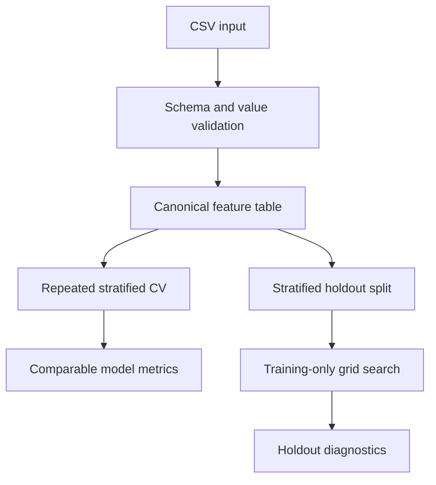

# Iris Classification Workbench

[](https://github.com/Vasyl-Slyvka/iris-classification-workbench/actions/workflows/ci.yml)
[](https://www.python.org/)
[](LICENSE)

A reproducible classical machine-learning workbench for comparing
classification pipelines on the Iris dataset. The project turns a small
teaching exercise into a tested workflow with schema validation, leakage-safe
preprocessing, repeated cross-validation, hyperparameter tuning, holdout
diagnostics, and machine-readable reports.

This is an educational evaluation project, not a claim of a novel model or a
production flower-recognition system.

## What it demonstrates

- Canonicalizes common Iris column variants, including `PetalWidthcm`.
- Rejects missing, non-numeric, blank, or non-positive measurements early.
- Compares KNN, logistic regression, RBF SVM, random forest, and Gaussian NB.
- Keeps scaling inside scikit-learn pipelines to avoid fold leakage.
- Uses repeated stratified cross-validation with fixed random seeds.
- Tunes hyperparameters only on the training portion of a holdout experiment.
- Exports dataset summaries, comparison tables, and diagnostics as JSON/CSV.
- Runs 18 automated tests on Python 3.10–3.13 in GitHub Actions.

## Quick start

```bash
python -m venv .venv
```

Activate the environment on Windows:

```powershell
.venv\Scripts\activate
```

Or on macOS/Linux:

```bash
source .venv/bin/activate
```

Install the package:

```bash
python -m pip install -e .
```

Validate the bundled dataset:

```bash
iris-workbench validate --data data/iris.csv
```

Compare all registered models using 5 folds repeated 3 times:

```bash
iris-workbench compare \
  --data data/iris.csv \
  --folds 5 \
  --repeats 3 \
  --seed 42 \
  --csv examples/model_comparison.csv \
  --json examples/model_comparison.json
```

On PowerShell, either place the command on one line or replace `\` with the
PowerShell continuation character (backtick).

Tune one model on the training split and evaluate it on an untouched holdout:

```bash
iris-workbench evaluate \
  --data data/iris.csv \
  --model rbf_svm \
  --tune \
  --seed 42 \
  --json examples/rbf_svm_holdout.json
```

The module form works without the console-script wrapper:

```bash
python -m iris_workbench validate --data data/iris.csv
```

## Reproduced benchmark

The committed comparison was generated from the bundled 150-row dataset with
5-fold stratified cross-validation repeated 3 times (`seed=42`).

| Model | Accuracy, mean | Accuracy, std | Macro F1, mean |
|---|---:|---:|---:|
| RBF SVM | 0.9622 | 0.0419 | 0.9623 |
| KNN | 0.9600 | 0.0303 | 0.9599 |
| Random forest | 0.9600 | 0.0349 | 0.9599 |
| Logistic regression | 0.9533 | 0.0361 | 0.9532 |
| Gaussian NB | 0.9511 | 0.0382 | 0.9510 |

In the separate stratified 80/20 holdout example, tuned RBF SVM classified
29 of 30 rows correctly (accuracy `0.9667`). That single holdout result is a
diagnostic, not the primary model-ranking estimate.

Generated evidence is committed in [`examples/`](examples/):

- [`dataset_summary.json`](examples/dataset_summary.json)
- [`model_comparison.csv`](examples/model_comparison.csv)
- [`model_comparison.json`](examples/model_comparison.json)
- [`rbf_svm_holdout.json`](examples/rbf_svm_holdout.json)

## Evaluation design



Every scale-sensitive model owns its `StandardScaler` inside a `Pipeline`.
During cross-validation, the scaler therefore learns only from the current
training fold. See [`docs/methodology.md`](docs/methodology.md) for the full
evaluation assumptions and limitations.

## Project structure

```text
.
├── data/                         # bundled Iris CSV
├── docs/methodology.md           # evaluation choices and limitations
├── examples/                     # reproduced CSV/JSON results
├── src/iris_workbench/
│   ├── cli.py                    # validate, compare, evaluate commands
│   ├── data.py                   # schema normalization and validation
│   ├── evaluation.py             # CV, tuning, and holdout diagnostics
│   ├── models.py                 # estimator registry and search grids
│   └── reporting.py              # deterministic report writers
└── tests/                        # unit and CLI tests
```

## Run the tests

```bash
python -m unittest discover -s tests -v
```

The CI workflow executes the same suite and a CLI smoke test across Python
3.10, 3.11, 3.12, and 3.13.

## Dataset note

The bundled CSV contains the well-known Iris measurements: four numeric flower
features and one of three species labels. The loader reports three identical
rows but retains them because the file has no specimen identifier that would
prove they are accidental duplicate records. The source dataset is commonly
attributed to R. A. Fisher's 1936 paper and is distributed by the
[UCI Machine Learning Repository](https://archive.ics.uci.edu/dataset/53/iris).

## License

The project code is available under the [MIT License](LICENSE).
